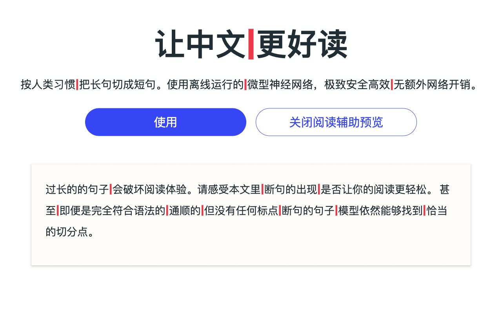

# Chrome Web Store 首发材料

基于当前 `manifest.json` 的 0.1.0 版；首发 Chrome Web Store，Edge 商店地址暂留空。发布材料与实际提交进度分别记录，不能把本地构建成功当成商店发布成功。

## 当前进度（2026-10-03）

- `npm test`：254 项通过，无失败或跳过。
- `npm run release:extension`：生成 `dist/haodu-0.1.0.zip`，27 个运行文件，约 14 MB；`unzip -t` 校验通过。
- ZIP SHA-256：`f57ff0f8747a726a61ae7d724fe2985387b5142dc5787d878241787c586f97b4`。
- 已核对源代码：模型与运行脚本均随包提供，开关写入 `chrome.storage.local`，没有向外部服务发送正文的代码。
- 公开隐私政策与支持链接已具备，440 × 280 小宣传图已准备。
- 用户截图已确认：项目“好读”已创建并上传包，当前状态为 Draft；正在填写 Privacy，尚未提交审核。Chrome 曾拒绝浏览器工具读取或截图，返回 `The extensions gallery cannot be scripted.`，因此下列内容供用户在后台手动填写，不能把材料准备完成当成后台已保存或已提交。
- 已于 2026-10-03 核对本地 `dist/haodu-0.1.0.zip`：全部文件与当前源码一致，SHA-256 与上述记录一致。以下隐私字段基于该版本的实际行为。
- 已于 2026-10-01 截取带有插件实际分隔线的阅读示例页，保存为 `release/assets/store-screenshot-1280x800.jpg`；已验证为 1280 × 800、RGB JPEG，无透明通道。最终安装验证仍待完成。

## 名称与摘要

名称：好读

摘要（来自 manifest，只说明用途和阅读收益）：中文阅读辅助，按人类习惯，将长句划分为短句，让阅读更轻松。

语言：简体中文。选择与阅读辅助最接近的商店分类。

## 详细介绍（实现方式、隐私与使用方法）

使用离线运行的微型神经网络，以细竖线标记分隔位置，保留原文。网页内容不上传，辅助计算无额外网络开销。随页面滚动按需处理，点击工具栏图标即可随时开启或关闭。

## 单一用途

对应字段：**Single purpose description**。

好读是一款中文阅读辅助扩展。用户开启后，在网页中文长句的适当位置添加视觉分隔线，帮助按较短的语意块阅读；保留原文，不改写或总结内容。切分位置由扩展内置的模型在本机计算，网页文本不上传到外部服务。

## 权限解释

| 字段 | 可填写的说明 |
| --- | --- |
| `offscreen justification` | 在浏览器的隐藏扩展页面中创建 Worker，运行随扩展打包的中文切分模型。多个网页共享同一份模型，避免重复加载。所需脚本、词表和模型权重均包含在扩展包内，网页文本仅在浏览器本地传递和计算。 |
| `scripting justification` | 在用户开启阅读辅助后，向当前符合条件的网页注入扩展包内的阅读脚本和 CSS，用于读取可见的中文文本、添加视觉分隔线，并在关闭时撤销这些标记。注入代码不来自远程服务器。 |
| `storage justification` | 仅使用 chrome.storage.local 保存全局阅读辅助开关（enabled），以便浏览器重启后保留用户选择。不存储网页正文、网页地址、浏览历史或推理结果，不使用 chrome.storage.sync。 |
| `Host permission justification` | 用户开启后，需要在其访问及切换到的 HTTP/HTTPS 网页上持续提供阅读辅助，因此申请这两类网页的网站访问权限；只使用 activeTab 无法在未再次点击扩展的其他网页上延续该设置。file:// 权限用于用户另行启用“允许访问文件网址”后处理本地 HTML 文件。读取的中文文本仅在本机计算，不上传到开发者或第三方。 |

**Are you using remote code?**：选择 **No, I am not using remote code**，无需填写远程代码 Justification。脚本、样式、模型词表和权重均随上传的 ZIP 打包，没有外部脚本加载或云端推理；本地 Worker 与本地 `importScripts()` 不属于远程代码。[官方填写说明](https://developer.chrome.com/docs/webstore/cws-dashboard-privacy#declare_any_remote_code)。

## 数据处理与审核说明

扩展读取网页文本用于当前本地推理，不向开发者或第三方传输正文、URL、历史记录或使用统计。除开关设置外，没有持久化的用户数据。商店隐私字段应与网站 `/privacy/` 一致；按提交时表单定义填写，不把“本地读取正文”描述成“完全不接触用户数据”。

**Data usage — What user data do you plan to collect…?**：按当前实现，勾选 **Website content**。这是对本地读取和处理网页文本的披露，不表示上传正文。Google 的[用户数据 FAQ 第 3 项](https://developer.chrome.com/docs/webstore/program-policies/user-data-faq)明确要求披露仅在本机处理或存储的数据。

其余数据类别不勾选：当前版本没有身份、健康、支付、认证或位置资料的专项收集，没有通信记录采集、浏览历史列表或用户行为日志功能。网页中出现的普通文本仍可能包含这些内容，不能据此宣称扩展绝不会接触敏感文字；这些文字和其他网页文本一样，只用于当次本地阅读辅助。浏览器标签页事件及滚动事件只触发页面处理，不保存为访问或操作日志。

**I certify that the following disclosures are true**：当前实现符合页面的三项声明，三项全部勾选：不在允许用途外出售或转移用户数据；不用于与单一用途无关的目的；不用于信用评估或贷款。

填写完成后点击 **Save draft**。保存草稿不等于提交审核。

网站地址：<https://github.com/77Vincent/super-reader>。正式官网 `https://haodu.site/` 尚未公开上线，暂不填写不可访问的网址。

隐私政策地址：<https://github.com/77Vincent/super-reader/blob/main/site/content/privacy.md>。该文件已在公开仓库中可访问，与站点使用同一份政策；官网上线后可改为 `https://haodu.site/privacy/`。

支持地址：<https://github.com/77Vincent/super-reader/issues>

审核人员无需账号、密码或付费。安装后打开普通中文网页，点击工具栏图标开启，再次点击关闭。产品官网包含静态演示并主动禁止扩展处理，不能用官网验证真实模型注入；应使用普通中文内容页面。

## 图片材料

- 128 × 128 图标：`icons/on-128.png`，已包含在 ZIP。
- 440 × 280 小宣传图：[store-promo-440x280.jpg](assets/store-promo-440x280.jpg)，对应可编辑源文件 [store-promo-440x280.svg](assets/store-promo-440x280.svg)。
- 1400 × 560 横幅宣传图（Marquee）：[store-marquee-1400x560.jpg](assets/store-marquee-1400x560.jpg)，RGB JPEG，无透明通道；对应可编辑源文件 [store-marquee-1400x560.svg](assets/store-marquee-1400x560.svg)。
- 商店截图：[store-screenshot-1280x800.jpg](assets/store-screenshot-1280x800.jpg)，1280 × 800、RGB JPEG，无透明通道。截自阅读示例页，正文中的分隔线来自实际运行的插件，可上传至 Screenshots。
- 官网预览图：[store-preview-1280x800.jpg](assets/store-preview-1280x800.jpg)，1280 × 800。按照 2026-09-29 用户选定的截图内容，保留标题、本地神经网络简介、两个按钮及第一张纸张示例卡片。
  - 图片说明：官网阅读辅助预览。该图展示官网的静态演示，不声称是此时运行扩展模型得到的结果。
  - 用户原附件为 1706 × 894 的内存截图，没有磁盘原文件。当前版本取自本地页面的同一组内容，按商店尺寸重新排版并截图，不是原附件的逐像素副本。
- 真实扩展截图用例：[store-reading-preview.html](assets/store-reading-preview.html)。该页没有阅读脚本，也没有人工插入的正文分隔线。通过本地 HTTP 服务打开后，开启待发布扩展，确认分隔线实际出现，再按 1280 × 800 截图。不能将未处理页面或人工标记页面描述为扩展运行结果。

```sh
python3 -m http.server 8096 --bind 127.0.0.1 --directory release/assets
# 打开 http://127.0.0.1:8096/store-reading-preview.html
```



## 官方要求

- [上传包准备](https://developer.chrome.com/docs/webstore/prepare)：ZIP 根目录必须直接包含 manifest。
- [隐私字段与权限解释](https://developer.chrome.com/docs/webstore/cws-dashboard-privacy)。
- [图片规格](https://developer.chrome.com/docs/webstore/images)。
- [提交发布](https://developer.chrome.com/docs/webstore/publish/)：在开发者后台上传 ZIP、补齐材料并提交审核。
- [官方 API](https://developer.chrome.com/docs/webstore/api/reference/rest)：V2 的上传接口针对已有项目，没有首次创建项目或填写商店文案、隐私表单的接口。[API 使用说明](https://developer.chrome.com/docs/webstore/using-api)仍要求在开发者后台完成商店详情与隐私字段；API 无法替代首次上架的全部后台步骤。
